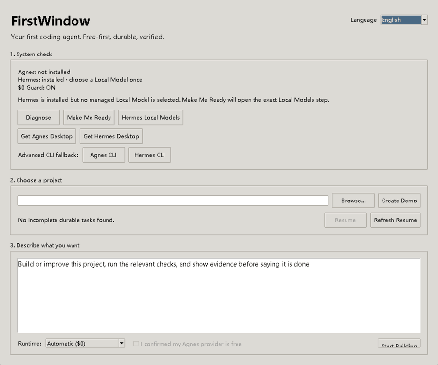

# FirstWindow

> **Your first coding agent. One window. A verified $0 path. No surprise API bill.**

FirstWindow is a beginner-first Windows launcher with **Hermes Agent as the primary executor**.

The primary cloud path is:

```text
FirstWindow control + durable state
        ↓
Hermes Agent
        ↓
Agnes API
```

Direct Agnes CLI is **not** a beginner-path dependency. It remains an explicit advanced/manual fallback only.

[Download Windows](../../releases/latest/download/FirstWindow-Windows-x64.exe) · [Beginner Guide](docs/BEGINNER.md)

## Real Windows demo

This is a real capture of the packaged Windows app, not a generated mockup.



[Open the full-size real app screenshot](docs/assets/firstwindow-window.png)
## Execution architecture

FirstWindow owns routing, checkpoints, evidence, resume state, and final verification. Hermes owns agent execution.

```text
1. Agnes API via isolated Hermes profile
   └─ only after explicit $0 confirmation + live probe + usage attestation

2. Hermes Managed Local
   └─ local fallback when a validated local model is ready

3. BLOCK
   └─ no silent paid/cloud fallback
```

The Agnes profile is named `firstwindowzero`. FirstWindow creates it **blank** instead of cloning the default Hermes profile, configures the official Agnes API endpoint/model, and forces `fallback_providers=[]`.

If an Agnes API key is missing, Make Me Ready asks the user to paste it explicitly. Only `AGNES_API_KEY` is written to the isolated profile; FirstWindow never copies OpenAI, DeepSeek, OpenRouter, or other credentials from the user's default Hermes profile.

## Windows beginner path

Open the EXE and use:

```text
Choose Language → Make Me Ready → Choose Folder → Describe Task → Start Building
```

**Make Me Ready / 一键就绪** does the deterministic work:

- installs Hermes through the official installer only after explicit confirmation
- creates/repairs the isolated `firstwindowzero` profile
- disables Hermes fallback providers for the Agnes $0 route
- requests the Agnes API key only when that isolated profile has none
- requires the user to confirm the current Agnes account/API route is free
- runs a real readiness prompt and requires `FIRSTWINDOW_READY`
- validates Hermes usage evidence against the expected Agnes model/provider
- refuses Start/Resume unless the exact route fingerprint has passed the live probe
FirstWindow also pins Hermes tool execution to the selected project using process cwd, `--in`, `--no-restore-cwd`, and `TERMINAL_CWD`. This protects older Hermes one-shot builds that could otherwise execute file tools in a stale/home workspace.

If any prerequisite, installer, API call, provider attestation, model check, or route proof fails, FirstWindow stays blocked.

## Durable tasks: done is not proof

Each task stores durable state under the selected project:

- objective and acceptance criteria
- checkpoint + next action
- append-only evidence
- Hermes usage attestation
- resume context

Default tasks deliberately separate two facts:

- **AC-001** — the agent process completed through the verified execution route
- **AC-002** — the requested task outcome was independently verified

A successful Hermes/Agnes run covers AC-001 only. `firstwindow verify` remains **NOT VERIFIED** until independent evidence covers AC-002. An agent saying “done” or exiting with code 0 is not sufficient by itself.

## Windows features

- English / 简体中文 live language switching with persisted preference
- Diagnose
- Make Me Ready / 一键就绪
- Automatic / Agnes API via Hermes / Hermes Local routing
- Create Demo
- Choose Folder
- Start Building
- Resume from durable checkpoint
- live execution output and evidence ledger
- fail-closed $0 guard
- Advanced CLI fallback for explicit/manual use only

The community Windows binary may be unsigned, so SmartScreen can show an unknown-publisher warning. Verify the EXE against `SHA256SUMS.txt` from the same Release.
## Python install

```bash
python -m venv .venv

# Windows
.venv\Scripts\activate

# macOS/Linux
source .venv/bin/activate

pip install -e .
firstwindow doctor
firstwindow-gui
```

Useful CLI commands:

```bash
firstwindow setup
firstwindow setup --install hermes --yes
firstwindow demo

# Custom acceptance criteria require explicit evidence for each criterion.
firstwindow run "Add a /health endpoint and test it" \
  --accept "tests pass" \
  --accept "GET /health returns 200"

firstwindow tasks --project .
firstwindow resume <task_id> --project .
firstwindow evidence <task_id> --criterion AC-001 --kind test --detail "tests passed"
firstwindow evidence <task_id> --criterion AC-002 --kind probe --detail "GET /health -> 200"
firstwindow verify <task_id>
```

## Security boundaries

FirstWindow does not silently choose an unknown-cost provider, clone a user's general Hermes credentials, treat configuration as readiness, or treat executor success as task completion.

The product goal is a small beginner surface backed by fail-closed routing, explicit credential/cost boundaries, real execution probes, durable recovery, and evidence-based acceptance.
